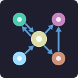
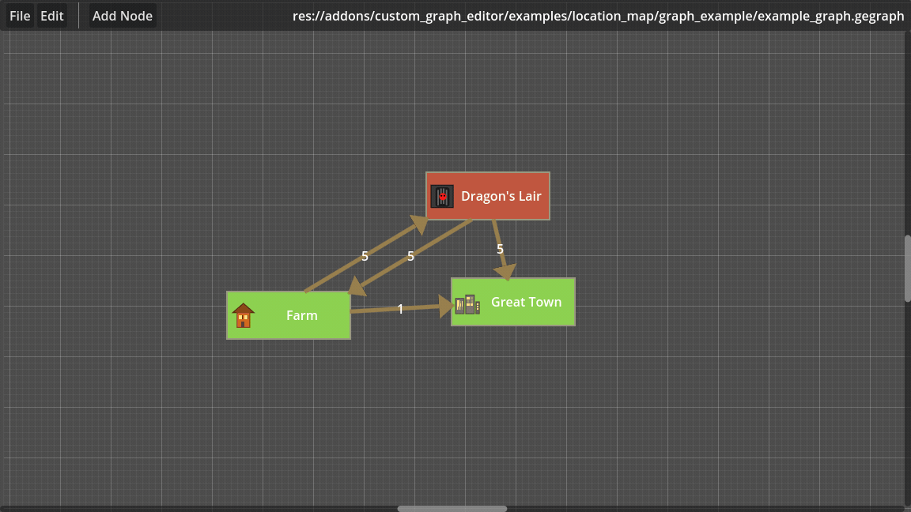
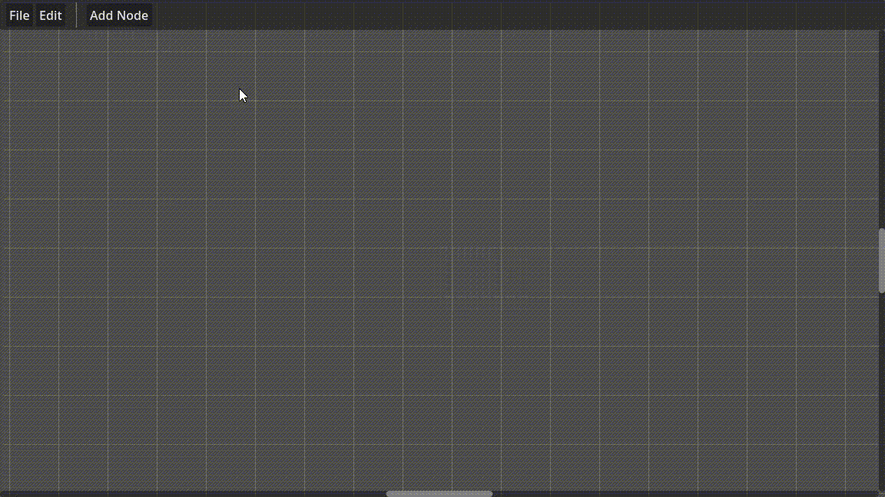

# Godot Custom Graph Editor

  
    A Godot 4.5+ add-on to build custom directed and undirected graph editor tailored to any project.

<table>
    <tr>
    <td width="50%">
        </video>
        
<em>Location Map Example</em>

    </td>
    <td width="50%">
        </video>
        
<em>Minimal Example</em>

    </td>
    </tr>
</table>

## Features
- An **extensible directed graph editor** with custom node and link types and a customisable toolbar
- Basic graph editing operations: add/remove nodes and links, history management (undo/redo), 
- Separation of data model and visual representation for easy customization
- Graph data export/import to file
- Load graph data only, for runtime

## Installation

  Note: This add-on is being published to the Godot Asset Library soon. Meanwhile, you can install it manually:
  - Download the latest release as ZIP file
  - Extract the zip and copy the `addons/custom_graph_editor` folder into your Godot project's `addons` directory
  - In Godot, go to `Project` -> `Project Settings` -> `Plugins` tab and enable the `Godot Custom Graph Editor` plugin

## Quick Start

If you just need to link nodes together visually in the editor, without any custom behavior, this add-on is ready to use out of the box by using the `custom_graph_editor.tscn` scene.

Otherwise, if you need to add metadata to nodes and/or links, or customize their appearance and behavior, you will need to extend the base custom graph editor classes provided by the add-on.

- You can see the [minimal example project](addons/custom_graph_editor/examples/minimal/) provided.
- For more details, see the [Advanced Customization](#advanced-customization) section below.
- You can try the demo either in Godot or use the web demo on itch: https://tehelka.itch.io/godot-custom-graph-editor.

## Basic Usage of the Graph Editor

- Graph elements (nodes and links) can be selected via left-mouse click or drag-box selection.
    - Selected elements can be moved around by dragging them with left-mouse button pressed.
    - Links cannot be moved freely, they are anchored to their source and target nodes.
- Right-mouse click between two nodes (click and drag) creates a link between them.
- For testing, in the toolbar, there is a 'Add Node' button that adds a new node. It might disappear in future versions.
- You can save your graph to a file using the `File > Save Graph` menu option (or `Ctrl+S`), and load it back using the `File > Load Graph` menu option (or `Ctrl+L`).

Notes:
- For now, **you cannot link two nodes more than once** (no multi-edges). This limitation will probably be removed in future versions.

## Advanced Customisation

To create a custom graph editor tailored to your project, you will need to extend the base classes provided by the add-on. Here are the main classes you will need to extend:
- `CGEGraphEditor`: The main graph editor class. You can extend this class to customize the overall behavior of the graph editor.
- Custom nodes:
    - `CGEGraphNode`: The base logic class for graph nodes. Extend this class to create custom node types with specific properties. Its visual representation is handled by `CGEGraphNodeUI`.
    - `CGEGraphNodeUI`: The base UI class for graph nodes. Extend this class to customize the appearance of your nodes.
- Custom links:
    - `CGEGraphLink`: The base logic class for graph links. Extend this class to create custom link types with specific properties. Its visual representation is handled by `CGEGraphLinkUI`.
    - `CGEGraphLinkUI`: The base UI class for graph links. Extend this class to customize the appearance of your links.

    - You can see the [minimal example project](addons/custom_graph_editor/examples/minimal/) to understand how to extend these classes and create a custom graph editor.
    - For more advanced customisation, see the [location map example](addons/custom_graph_editor/examples/location_map/) to see how to add meta data to nodes, links and an inspector to edit these data.
    - A tutorial might be provided in future versions.

## Documentation
  
For now, the only code documentation available is the code comments. You can search it directly inside Godot editor.

## Known Limitations

This add-on is currently in development and in beta stage. Some known limitations include:
- No visual inspector for nodes and links to edit their properties. This has to be implemented manually in custom classes for now, but **will be provided in future versions**. See a custom implementation in the [location map example](addons/custom_graph_editor/examples/location_map/).
- No support for multi-edges (linking two nodes more than once)
- Multiple type of nodes is not really handled by the add-on, it is only possible to have one node type. The same applies to links. It is considered for future versions.
- No snapping/grid support

Want a particular feature or found a bug? Please open an issue to discuss it!

## License

The Custom Graph Editor add-on is provided under the MIT license. License is in [addons/custom_graph_editor/LICENSE.md](addons/custom_graph_editor/LICENSE).
